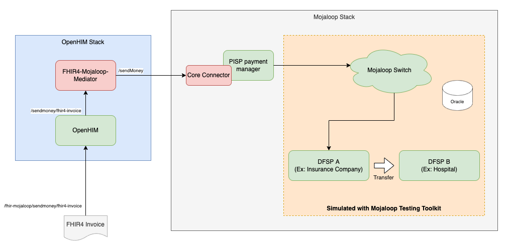

## PoC for initiating a thridparty transfer in mojaloop out of a fhir invoice

This is to demo a third party transfer using the following components
- OpenHIM
- FHIR-Mojaloop OpenHIM Mediator
- PISP payment manager
- Mojaloop Testing Toolkit

### Technical Architecture


### Deployment Instructions

- Clone this repository
- Start OpenHIM
  ```
  cd openhim
  docker-compose up
  ```
- Now, navigate to your web server and you should see the OpenHIM-console load (eg. `http://localhost:9080`) and login. The default username and password are:
  - username: `root@openhim.org`
  - password: `openhim-password`

  You will be prompted to change this. Change the password to `123456` to match the mediator configuration. If you want any other password, please change the mediator configuration too.

  > **Note:** You will have problems logging in if your OpenHIM server is still setup to use a self-signed certificate (the default). To get around this you can use the following workaround (the proper way to solve this is to upload a proper certificate into the OpenHIM-core):

  Visit the following link: `https://localhost:8080/authenticate/root@openhim.org` in Chrome. Make sure you are visiting this link from the system that is running the OpenHIM-core. Otherwise, replace `localhost` and `8080` with the appropriate OpenHIM-core server hostname and API port. You should see a message saying "**Your connection is not private**". Click "Advanced" and then click "Proceed". Once you have done this, you should see some JSON, you can ignore this and close the page. Ths will ignore the fact that the certificate is self-signed. Now, you should be able to go back to the Console login page and login. This problem will occur every now and then until you load a properly signed certificate into the OpenHIM-core server.

---

- Run fhir4-mojaloop openhim mediator (You need to have node version v16.14.2 installed)
  ```
  cd openhim/mediators/openhim-mediator-fhir-mojaloop-poc
  npm run startDev
  ```
  Then you should see a log message in the console like "info: Successfully registered mediator!"
- Run Third party SDK stack
  ```
  cd thirdparty-sdk
  docker-compose up
  ```
---
That's it, all the services are deployed.

### Configuring OpenHIM channel
- Open openHIM console on 'http://localhost:9080' with username 'root@openhim.org' and password '123456' (As we changed to this in previous step)
- Goto 'Mediators' and click on the entry 'openhim-mediator-fhir-mojaloop-poc'
- Click on the green '+' icon there to create a channel. All the configuration for the channel is provided as default configuration in the mediator. So we don't need to change the channel configuration.

### Have the following web pages ready to monitor the transaction
- OpenHIM console: Login to the console and goto 'Transaction Log'
- Run fhir4-mojaloop openhim mediator (You need to have node version v16.14.2 installed)
- Payee mobile app simulator: Open the URL http://localhost:6060/payeemobile and login with username '987654321' and don't need password
- Mojaloop Testing Toolkit Monitoring: Open the URL http://localhost:6060/admin/monitoring

### Making a transfer and monitor the logs
- Execute the following HTTP request either from command line or from postman.
  ```
  curl --location --request POST 'http://localhost:5001/fhir-mojaloop/sendmoney/fhir4-invoice' --header 'Content-Type: application/json' --data-raw '{
  "resourceType": "Invoice",
  "id": "b88e5a38-35ad-4d8c-aad3-44b4ace8c0b1",
  "identifier": [
      {
          "type": {
              "coding": [
                  {
                      "system": "https://openimis.github.io/openimis_fhir_r4_ig/CodeSystem/openimis-identifiers",
                      "code": "UUID"
                  }
              ]
          },
          "value": "b88e5a38-35ad-4d8c-aad3-44b4ace8c0b1"
      },
      {
          "type": {
              "coding": [
                  {
                      "system": "https://openimis.github.io/openimis_fhir_r4_ig/CodeSystem/openimis-identifiers",
                      "code": "Code"
                  }
              ]
          },
          "value": "IV-UC-8156989548-105"
      }
  ],
  "status": "active",
  "type": {
      "coding": [
          {
              "system": "https://openimis.github.io/openimis_fhir_r4_ig/CodeSystem/bill-type",
              "code": "policy",
              "display": "Policy"
          }
      ]
  },
  "recipient": {
      "reference": "Patient/D944AFE5-F1A9-45D1-BE82-7BE28719A7E1",
      "type": "Patient",
      "identifier": [{
          "type": {
              "coding": [
                  {
                      "system": "https://openimis.github.io/openimis_fhir_r4_ig/CodeSystem/openimis-identifiers",
                      "code": "UUID"
                  }
              ]
          },
          "value": "D944AFE5-F1A9-45D1-BE82-7BE28719A7E1"
      }]
  },
  "date": "2022-04-22",
  "lineItem": [
      {
          "chargeItemCodeableConcept": {
              "coding": [
                  {
                      "system": "https://openimis.github.io/openimis_fhir_r4_ig/CodeSystem/bill-charge-item",
                      "code": "policy",
                      "display": "Policy"
                  }
              ]
          },
          "priceComponent": [
              {
                  "extension": [
                      {
                          "url": "https://openimis.github.io/openimis_fhir_r4_ig//StructureDefinition/unit-price",
                          "valueMoney": {
                              "value": 2390.0,
                              "currency": "USD"
                          }
                      }
                  ],
                  "type": "base",
                  "code": {
                      "coding": [
                          {
                              "system": "Code",
                              "code": "Code",
                              "display": "IV-UC-8156989548-105"
                          }
                      ]
                  },
                  "factor": 1.0,
                  "amount": {
                      "value": 2390.0,
                      "currency": "USD"
                  }
              }
          ]
      }
  ],
  "totalNet": {
      "value": 2390.0,
      "currency": "USD"
  },
  "totalGross": {
      "value": 2390.0,
      "currency": "USD"
  }
}'
  ```
- You should get the 'Completed' status in the response and 'transactionRequestState' should be 'ACCEPTED' in the approveResponse body parameter.
- Open openHIM console on 'http://localhost:9080' with username 'root@openhim.org' and password '123456' (As we changed to this in previous step)
- Goto "Transaction Log" and you can find the transaction there.
- You can check various requests and response in TTK UI http://localhost:6060
- You should see the incoming notification in payee mobile app simulator
